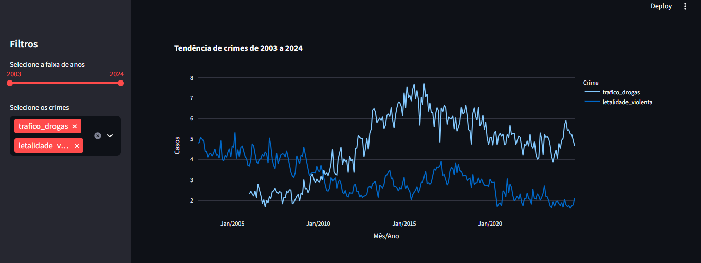
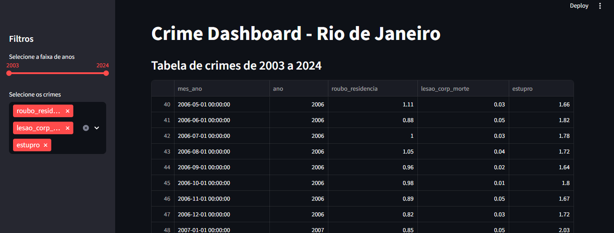

# Crime Dashboard - Rio de Janeiro

This project is an **interactive dashboard** that visualizes crime statistics in the state of Rio de Janeiro. The data comes from a historical monthly dataset by municipality, starting from 2003, provided by the government. The goal of the dashboard is to allow users to explore crimes over time, filtering by year range and crime types.

> **Data source:** the data was obtained from [dados.gov.br](https://dados.gov.br/dados/conjuntos-dados/isp-estatisticas-de-seguranca-publica) and can be freely downloaded in CSV format.

---

## 📊 Features

* Filter by **year range**.
* Select multiple crime types.
* Dynamic visualization:

  * **Interactive table** showing filtered data.
  * **Line charts** showing trends for selected crimes.
* Responsive dashboard, runnable in a browser via **Streamlit**.

---

## 📁 Project Structure

```
crime_dashboard_rj/
│
├─ data/
│   └─ BaseEstadoTaxaMes.csv       # CSV with crime data
│
├─ src/
│   └─ dashboard.py                # Dashboard code
│
├─ assets/                         # Images for README
│   ├─ 1.png
│   ├─ 2.png
│   └─ 3.png
│
├─ requirements.txt                # Required libraries
├─ README.md                        # This file
└─ .gitignore
```

---

## 🛠️ Installation and Setup

1. **Clone the repository:**

```bash
git clone https://github.com/lucasdasilvamaria/crime_dashboard_rj.git
cd crime_dashboard_rj
```

2. **Create a virtual environment** (optional but recommended):

```bash
python -m venv .venv
```

3. **Activate the virtual environment:**

* Windows:

```bash
.venv\Scripts\activate
```

* Linux / MacOS:

```bash
source .venv/bin/activate
```

4. **Install dependencies:**

```bash
pip install -r requirements.txt
```

5. **Ensure the CSV `BaseEstadoTaxaMes.csv` is in the `data/` folder.**
   You can also download it directly from [dados.gov.br](https://dados.gov.br/dados/conjuntos-dados/isp-estatisticas-de-seguranca-publica).

---

## 🚀 How to Run

In the terminal, inside the project folder:

```bash
streamlit run src/dashboard.py
```

This will open the dashboard in your default web browser.

---

## ⚙️ Usage

* **Year range:** Use the slider in the sidebar to select the period you want to analyze.
* **Crime selection:** Check the crimes you want to visualize in the chart and table.
* **Data table:** Shows all selected crimes for the filtered years.
* **Line chart:** Shows the trend of selected crimes over time.

---

## 🖼️ Example Visualizations

**Main Dashboard:**


**Filtered table by years and crimes:**



**Crime trend chart:**



---

## 📊 Libraries Used

* `pandas` - data manipulation
* `numpy` - numerical operations
* `plotly` - interactive visualizations
* `streamlit` - web dashboard
* `openpyxl` - (optional, for exporting to Excel)

---

## 💡 Possible Improvements

* Add an **interactive map** by municipality using `folium`.
* Include **aggregated statistics**, like averages and percentage variations.
* Export charts and tables to **PDF/Excel**.
* Improve the dashboard layout and style using `streamlit` or `dash`.

---

## ⚖️ License

This project is open-source and available for **educational and professional use**.

---

## 📌 Notes

* The dashboard uses official crime data, but some information may be incomplete or missing for certain months.
* Always check the data quality before making decisions based on it.
